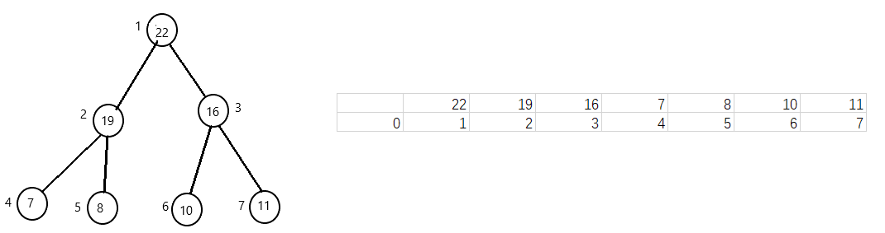
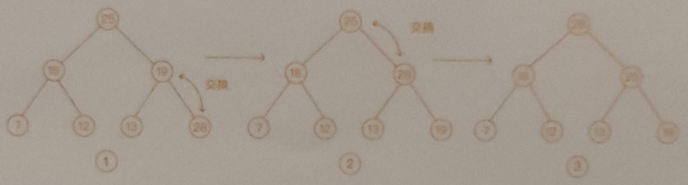
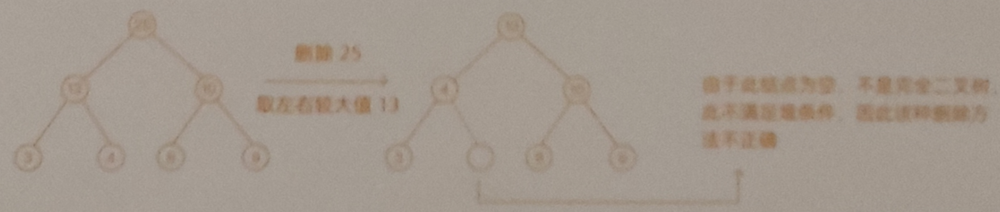

# 堆  

### 概念  
#### 符合以下两点的就是堆 
1. 堆是一个完全二叉树  
2. 堆中每一个结点的值都必须大于等于(或小于等于)其子树中每个结点的值，都大于等于的叫大顶堆，都小于等于的叫小顶堆  
#### 堆存储  
由于堆是一个完全二叉树，比较适合用数组存储，可以使用下标方便找到左右子结点和父结点
如图所示，对于结点 i 的结点，其左子结点的下标就是 i * 2, 右子结点的下标就是 i * 2 + 1，父结点下标就是 i / 2

#### 常见操作  
以大顶堆为例，小顶堆同理
1. 堆化图  
    方向分为从下到上和从上到下，这里以从下到上为例:
    每次在数组最后添加一个元素，依次让新插入的结点和父亲结点进行比较，如果大于其父结点则交换，直到其小于等于父结点  

   

2. 插入元素
    给堆中插入一个元素，则进行上述的堆化，从而保证堆的特性

3. 删除
    大顶堆的堆顶元素就是该数组的最大值，当删除堆顶元素之后， 就需要把第二大的元素放到堆顶以继续符合大顶堆的定义。根据堆的定义可如第二大元素一定在左右子结点中，然后再依次迭代处理第二大元素所在的子结点，直到叶子结点被删除，但是这种思路会出现不符合二叉树的问题，如图所示
    实际上的堆的解决思路：把最后一个元素移到堆顶， 然后进行堆化，避免出现数组空洞造成不符合满二叉树的问题，如下图所示：

    
    
4. 上述的插入删除的操作的空间复杂度都是堆高，也就是 O(log n)
### 堆的实现  
建堆两种思路：
1. 在数组的基础上，从下标 1 开始，依次填入2，3... n 的元素，类似上面的插入过程，从前向后处理数据，每个数据插入的时候，从下往上堆化，这种处理效率为O(nlogn)  
2. 从后向前处理数组，并且每个数据从上往下进行堆化，考虑叶子结点往下堆化只能是自己，因此从非叶子结点开始堆化，时间复杂度为 O(n)
### 堆的应用  
1. 堆排序
包括建堆和排序，将下标 n/2 到 1 的节点，依次从上到下的堆化操作，然后将数组中的数据组织成堆，接下来迭代处理将堆顶的元素放到堆的末尾，并将堆的大小减 1，然后再堆化，重复这个过程，直到元素剩下一个， 此时数组就是有序的了。
2. 大数据中选出 TopK (静态数据、动态数据)， 如从几十亿条订单日志中选出金额靠前的 1000 条数据。  
3. 优先队列  
4. 中位数  
### 常考面试题  
1. 10GB 文件，计算机只有 512MB 大小的可用内存，如何按照字符串大小，给这个10GB的大文件排序
2. 静态数据求中位数
3. 动态数据求中位数

