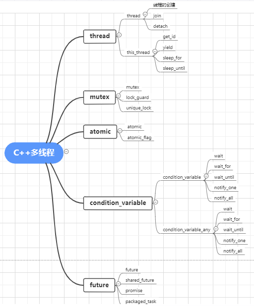

</img>
# 多进程与多线程
## 多进程
操作系统对进程提供了大量的保护机制，以避免一个进程修改了另一个进程的数据，使用多进程比使用多线程更容易写出相对安全的代码。但是这也造就了多进程并发的两个缺点：
1. 进程间的通信分别有: 
   - 管道( pipe )
     半双工的通信方式，数据只能单向流动.只能在具有亲缘关系的进程间使用。通常指父子进程。
   - 有名管道 (namedpipe)
     半双工的通信方式, 允许无亲缘关系进程间的通信.
   - 信号量(semophore )
     信号量是一个计数器，可以用来控制多个进程对共享资源的访问。它常作为一种锁机制，防止某进程正在访问共享资源时，其他进程也访问该资源。
   - 消息队列( messagequeue )
   - 信号 (sinal )
   - 共享内存(shared memory )   
## 多线程
锁机制：包括互斥锁、条件变量、读写锁

互斥锁提供了以排他方式防止数据结构被并发修改的方法。
读写锁允许多个线程同时读共享数据，而对写操作是互斥的。
条件变量可以以原子的方式阻塞进程，直到某个特定条件为真为止。对条件的测试是在互斥锁的保护下进行的。条件变量始终与互斥锁一起使用。
https://zhuanlan.zhihu.com/p/430069448
https://mp.weixin.qq.com/s/6PGx_Tq2o7bv05zGJivcUw
https://cpp1024.com/articles/multi_thread_programming/3-1-%E7%BA%BF%E7%A8%8B%E5%9F%BA%E7%A1%80.html