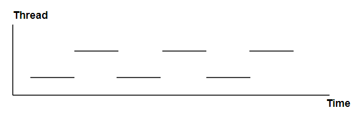

</img>
# 多进程与多线程
## 多进程
1. 进程间的通信分别有: 
    - **管道( pipe )**
      半双工的通信方式，数据只能单向流动.只能在具有亲缘关系的进程间使用。通常指父子进程。
    - **有名管道 (namedpipe)**
      半双工的通信方式, 允许无亲缘关系进程间的通信.
    - **信号量(semophore )**
      信号量是一个计数器，可以用来控制多个进程对共享资源的访问。它常作为一种锁机制，防止某进程正在访问共享资源时，其他进程也访问该资源。
   - **消息队列(messagequeue)**
    消息队列是由消息的链表，存放在内核中并由消息队列标识符标识。消息队列克服了信号传递信息少、管道只能承载无格式字节流以及缓冲区大小受限等缺点。
   - **信号 (sinal)**
    信号是一种比较复杂的通信方式，用于通知接收进程某个事件已经发生。
   - **共享内存(shared memory)**
    共享内存就是映射一段能被其他进程所访问的内存，这段共享内存由一个进程创建，但多个进程都可以访问。共享内存是最快的 IPC 方式，它是针对其他进程间通信方式运行效率低而专门设计的。它往往与其他通信机制(eg.信号)配合使用，来实现进程间的同步和通信。
## 多线程
1. 锁机制：包括互斥锁、条件变量、读写锁
   - 互斥锁 : 提供了以排他方式防止数据结构被并发修改的方法。
   - 读写锁 : 允许多个线程同时读共享数据，而对写操作是互斥的。
   - 条件变量 : 可以以原子的方式阻塞进程，直到某个特定条件为真为止。对条件的测试是在互斥锁的保护下进行的。条件变量始终与互斥锁一起使用。
2. 多线程并发: 同一个进程中执行多个线程.
   - 优点 : 线程是轻量级的进程，<u>每个线程可以独立的运行不同的指令序列，但是线程不独立的拥有资源，依赖于创建它的进程而存在。</u>也就是说，<u>同一进程中的多个线程共享相同的地址空间，可以访问进程中的大部分数据，指针和引用可以在线程间进行传递。</u>这样，同一进程内的多个线程能够很方便的进行数据共享以及通信，也就比进程更适用于并发操作。
   - 缺点 : 做更多的工作以保证对共享数据段的操作是以预想的操作顺序进行的，并且要极力的避免死锁(deadlock)。
3. 单核多线程并发:
  
4. 多核多线程并行:
  

