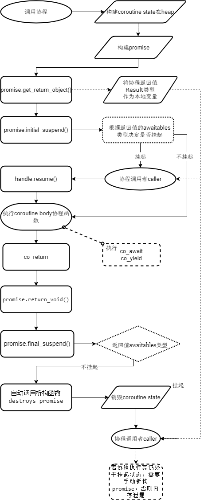

- [什么是协程](#什么是协程)
- [co\_await](#co_await)
- [Awaitable 和 Awaiter 的解释](#awaitable-和-awaiter-的解释)
  - [Cppreference的详解](#cppreference的详解)
  - [自定义 Awaiter](#自定义-awaiter)
- [coroutine\_handle](#coroutine_handle)
- [Coroutine body 协程体的简略执行逻辑](#coroutine-body-协程体的简略执行逻辑)
- [co\_yield](#co_yield)
- [coroutine state 协程状态](#coroutine-state-协程状态)
- [promise\_type](#promise_type)
    - [协程函数返回值 returned\_type 类型定义](#协程函数返回值-returned_type-类型定义)
    - [coroutine\_traits的协程特化](#coroutine_traits的协程特化)
- [协程执行流程图](#协程执行流程图)
  - [图解协程代码运行逻辑](#图解协程代码运行逻辑)
  - [图解 Awaitable 运行逻辑](#图解-awaitable-运行逻辑)
  - [图解 generator 运行逻辑](#图解-generator-运行逻辑)
- [有栈协程与无栈协程的区别](#有栈协程与无栈协程的区别)
- [reference 参考资料](#reference-参考资料)

## 什么是协程
协程相关的关键字，有下面三个：
* co_await
* co_yield
* co_return  

一个协程里只能使用 co_return，不能使用 return。
<b>这三个关键字只要有一个出现在函数中，这个函数就是一个协程</b>——从外部则看不出来，没有用其他语言常用的 async 关键字来标记（async 已经有其他用途,见***std::async*** ）。
C++ 认为一个函数是否是一个协程是一个实现细节，不是对外接口的一部分。

实际上C++ 的编译器如何识别协程函数呢？是通过**函数返回值类型**。
C++ 协程函数的返回值类型有要求:
* `协程状态` (coroutine state):记录协程状态，是分配于堆的内部对象：
  ```
  * 形参（协程函数的参数）
  * 协程挂起的点
  * 临时变量
  ```
* `承诺对象`（promise）: 从协程内部操纵。协程通过 promise_type 对象提交其结果或异常。
* `协程句柄`（coroutine_handle）: 协程的唯一标示。用于恢复协程执行或销毁协程帧。

C++ 协程函通过自定义等待体 Awaitable 来控制如何执行挂起的调度。
* `Awaitable` or `Awaiter`: co_await 关键字调用的对象。

## co_await

一般co_await的使用如下。
```c++
auto result = co_await 表达式; //暂停执行直到恢复
```
对于这里 co_await 后的<a id="awaitable"><b>表达式</b>(expression)</a>，编译器会把它理解为：
```c++
auto&& __a = 表达式;
if (!__a.await_ready()) {
  __a.await_suspend(std::coroutine_handle<>...); //参数是协程句柄
  // 挂起/恢复点
}
auto result = __a.await_resume();
```
"表达式" 需要支持 `await_ready`、`await_suspend` 和 `await_resume` 三个接口。

如果 await_ready() 返回True，就代表不需要真正挂起，直接返回后面的结果就可以；
否则 await_ready() 返回False，返回执行 await_suspend 之后即挂起协程，等待协程被唤醒之后再返回 await_resume() 的结果。
由 await_resume() 返回 co_await 结果.
<u>这样的一个"表达式"被称作是个[awaitable]( #awaitable-和-awaiter-的解释)。</u>

标准里定义了两个 awaitable，如下所示：
```c++
struct suspend_always {
  bool await_ready() const noexcept
  {
    return false;
  }
  void await_suspend( coroutine_handle<> ) const noexcept {}
  void await_resume() const noexcept {}
};

struct suspend_never {
  bool await_ready() const noexcept
  {
    return true;
  }
  void await_suspend(coroutine_handle<>) const  noexcept {}
  void await_resume()
    const noexcept {}
};
```
`suspend_always` 永远告诉调用者需要挂起;
`suspend_never` 则永远告诉调用者不需要挂起。
两者的 await_suspend 和 await_resume 都是平凡实现，不做任何实际的事情。
一个 awaitable 可以*自行实现这些接口*`await_ready`、`await_suspend` 和 `await_resume`，以定制对应的**挂起之前、如何挂起、恢复之后**需要执行的操作.

## Awaitable 和 Awaiter 的解释
### Cppreference的详解
[cppreference的awaitable&&awaiter介绍，在co_await讲解里面。](https://en.cppreference.com/w/cpp/language/coroutines)
ps:直接看英文，译文会丢失信息。


首先，以下列方式将 <b>co_await expr</b> 的 `expr`（表达式） 视为 Awaitable（可等待体）：
* 如果 `expr`表达式 由 `initial suspend(初始挂起点)`、`final suspend(最终挂起点)` 或 `yield expression(yield 表示式)` 所产生，那么awaitable是 `expr`表达式 本身。
* 否则，如果当前协程的承诺类型 `Promise` 拥有成员函数 `await_transform()`，那么 `Awaitable` 是 `promise.await_transform()`(即`expr`表达式)。<a id="Awaitable等价于promise.await_transform()"><a href="#await_transform()的定义">await_transform()的定义。</a></a>
* 否则，`Awaitable` 是 `expr`表达式 本身。

然后以下列方式获得 `Awaiter`（等待器）对象：
* 如果针对 operator co_await 的重载决议给出单个最佳重载，那么 Awaiter 是该调用的结果:
  * 对于成员重载为 `awaitable.operator co_await();`
  * 对于非成员重载为 `operator co_await(static_cast<Awaitable&&>(awaitable));`
* 否则，<b> 如果重载决议找不到 operator co_await，那么 Awaiter 是 Awaitable 本身 </b>。
* 否则，如果重载决议有歧义，那么程序非良构。

### 自定义 Awaiter
实际上，对于 co_await <expr> 表达式当中 expr 的处理，C++ 有一套完善的流程：

如果 promise_type 当中定义了 await_transform 函数，那么先通过 promise.await_transform(expr) 来对 expr 做一次转换，得到的对象称为 awaitable；否则 awaitable 就是 expr 本身。
接下来使用 awaitable 对象来获取等待体（awaiter）。如果 awaitable 对象有 operator co_await 运算符重载，那么等待体就是 operator co_await(awaitable)，否则等待体就是 awaitable 对象本身。

听上去，我们要么给 promise_type 实现一个 await_tranform() 函数，要么就为整型实现一个 operator co_await 的运算符重载，二者选一个就可以了。
* 方案一: 实现 promise_type::await_tranform ;
* 方案二: 实现 operator co_await的重载:
    ```
    auto operator co_await(T value) {
    struct Awaiter {
        T value;
        bool await_ready() const noexcept {
        return false;
        }
        void await_suspend(std::coroutine_handle<Generator::promise_type> handle) const {
        handle.promise().value = value;
        }
        void await_resume() {  }
    };
    return IntAwaiter{.value = value};
    }
    ```

## coroutine_handle
coroutine_handle 是 C++ 标准库提供的类模板。这个类是用户代码跟系统协程调度真正交互的地方，有下面这些成员函数会用到：

1. destroy：销毁协程;
2. done：判断协程是否已经执行完成;
3. resume：让协程恢复执行;
4. promise_type：通过**实现**在协程**执行期间**的**特定点调用的方法**来**定义和控制**协程本身的行为。
   1. 在某些用例中，协程 Promise 对象确实起着与 std::future 对的 std::promise 部分类似的作用，但对于其他用例，这种类比有些不适用。
   2. 将协程的 Promise 对象视为"**协程状态控制器**"对象可能更容易，该对象控制协程的行为并可用于跟踪其状态。
5. address() / from_address():
   1. .address() / from_address() 函数允许将 coroutine_handle 转换为/转换为一个 void* 指针。
   2. 这主要是为了允许作为 "上下文 "参数传递到现有的 C 风格 API 中，因此在某些情况下，您可能会发现它在实现 Awaitable 类型时非常有用。

```C++
namespace std::experimental
{
    template<typename Promise>
    struct coroutine_handle;

    template<>
    struct coroutine_handle<void>
    {
        bool done() const;
        void resume();
        void destroy();

        void* address() const;
        static coroutine_handle from_address(void* address);
    };

    template<typename Promise>
    struct coroutine_handle : coroutine_handle<void>
    {
        Promise& promise() const;
        static coroutine_handle from_promise(Promise& promise);

        static coroutine_handle from_address(void* address);
    };
}
```

## Coroutine body 协程体的简略执行逻辑

协程的执行过程大致是这个样子的：
1. 为协程调用分配一个协程帧，含协程调用的参数、变量、状态、promise 对象等所需的空间。
2. 调用 promise.get_return_object()，返回值会在协程第一次挂起时返回给协程的调用者。
3. 执行 co_await promise.initial_suspsend()；根据上面对 co_await 语义的描述，协程可能在此第一次挂起（但也可能此时不挂起，在后面的协程体执行过程中挂起）。
4. 执行协程体中的语句，中间可能有挂起和恢复；如果期间发生异常没有在协程体中处理，则调用 promise.unhandled_exception()。
5. 当协程执行到底，或者执行到 co_return 语句时，会根据是否有非 void 的返回值，调用 promise.return_value(…) 或 promise.return_void()，然后执行 co_await promise.final_suspsend()。

*伪代码逻辑*
```c++

  frame = operator new(…);
  promise_type& promise = frame->promise;

  // 在初次挂起时返回给调用者
  auto return_value = promise.get_return_object();

  co_await promise.initial_suspsend();
  try {
    执行自定义协程体 coroutine body;
    可能被 co_wait、co_yield 挂起;
    恢复后继续执行，直到 co_return;
  }
  catch (...) {
    promise.unhandled_exception();
  }

  final_suspend:
    co_await promise.final_suspsend();
```

## co_yield
`co_yield`的表达式等价于：
```C++
co_await promise.yield_value(表达式);
```

## coroutine state 协程状态
见[cppreference::coroutines::Execution](https://en.cppreference.com/w/cpp/language/coroutines)

协程状态 (coroutine state)，它是一个动态存储分配（除非优化掉其分配）的内部对象，其包含：
* 承诺对象promise;
* 各个形参（全部按值复制）;
* 当前暂停点的一些表示，使得程序在恢复时知晓要从何处继续，销毁时知晓有哪些局部变量在作用域内;
* 生存期跨过当前暂停点的局部变量和临时量;

当协程开始执行时，它进行下列操作：
* 用 operator new 分配**协程状态**对象;
* 将所有函数形参复制到协程状态中：按值传递的形参被移动或复制，按引用传递的参数保持为引用（因此，如果在被指代对象的生存期结束后恢复协程，它可能变成悬垂引用）;

## promise_type
promise_type被编译器用来控制协程的行为。有两种使用方式：应该将其定义为协程类型的成员
```
promise_type
  |-> returned_type::promise_type // 定义为协程类型的成员
  |-> std::coroutine_traits       // 定义为coroutine_traits模板特化类型的公开成员
      |-> std::coroutine_traits<R, Args...>::promise_type
```
#### 协程函数返回值 returned_type 类型定义
```C++
class Task
{
public:
    using co_handle = coroutine_handle<promise_type>;
    struct promise_type {
        // creating coroutine object -mandatory强制
        auto get_return_object() { return Task{std::
            coroutine_handle<promise_type>::from_promise(*this)}; }
        
        // returns awaitable object - mandatory强制
        auto initial_suspend() { return std::suspend_always{}; }
        auto final_suspend() { return std::suspend_always{}; }

        // one of below is mandatory强制 and only one must be present在场的;
        auto return_value(int val) { value_ = val; return std::suspend_never{};}
        void return_void() {}
        
        // mandatory强制
        void unhandled_exception() { std::terminate(); }

        // support for yielding values - returns awaitable;
        // co_yield 表达式，返回 awaitable； 
        auto yield_value(uint64_t value){ value_ = value; return suspend_always(); }

        // modification of the awaitable;
        auto await_transform(/*co_await operand*/ );
        
        uint64_t value_;
    };
    explicit Task(co_handle handle) : handle_(handle) { }
    ~Task(){ handle_.destroy(); }
    Task(const Task&) = delete;
    Task(Task&&) = default;
public:
//自定义函数
    bool resume(){ if(!handle_.done()){ handle_.resume(); } return !handle_.done();}
    uint64_t get(){ return handle_.promise().value_; }
private:  
    co_handle handle_;
};
```
协程函数返回值`returned_type`类型，这里定义为 `Task`类。结构内部有个 `promise_type`，而私有成员只有一个协程`句柄handle`。
协程构造需要一个协程句柄，析构时将使用协程句柄来销毁协程；为简单起见，我们允许结构被移动，但不可复制（以免重复调用 `handle_.destroy()`）
自定义函数：`resume()` 会判断协程是否已经结束，没结束就恢复协程的执行；当协程再次挂起时（调用者恢复执行），返回协程是否仍在执行中的状态。而 `get()` 简单地返回存储在 `promise` 对象中的数值。
1. Promise 结构里面可以存放数据，比如数据成员 `value_`，存放供 Task::get 取用的数值。
2. `get_return_object()`
   调用协程的返回值就是 `get_return_object()` 的结果。这儿就是使用 promise 对象来构造一个类型Task。
3. `initial_suspend()`
   此处返回 suspend_always()，即协程立即挂起，调用者马上得到 get_return_object() 的结果。
4. `final_suspend()`
   此处返回 suspend_always()，即使执行到了 co_return 语句，协程仍处于挂起状态。
   如果我们返回 suspend_never() 的话，那一旦执行了 co_return 或执行到协程结束，协程就会被销毁，连同已初始化的本地变量和 promise，并释放协程帧内存。
5. `yield_value()`
   调用`co_yield`后会调用这个函数，可以保存co_yield的结果，其返回其返回值为std::suspend_always表示协程会挂起，如果返回std::suspend_never表示不挂起。这儿仅对 value_ 进行赋值，然后让协程挂起（执行控制回到调用者）。
6. `return_void()`
    调用`return_void()`有以下情况：
   1. co_return;
   2. co_return expr; 当expr是的类型是void
7. `return_value(expr)`
   `return_value()`函数用于获取协程的返回值。当协程执行完成时，可以使用 co_return 语句返回一个值，然后 return_value() 函数将获取这个返回值。这样的机制可以让我们在协程执行期间获取协程的返回值，而不必等到整个协程执行完毕。
   
8. `unhandled_exception()`
   我们这儿也不应该发生任何异常，所以我们简单地调用 terminate 来终结程序的执行。

9. `await_transform()`
    `await_transform()`是协程内部用于处理 co_await 表达式的函数。当在协程中使用 co_await 时，编译器会调用 await_transform() 来转换 co_await 表达式的操作数。 <a id="await_transform()的定义"><a href="#Awaitable等价于promise.await_transform()">Awaitable 等价于 promise.await_transform()。</a></a>

#### coroutine_traits的协程特化
coroutine_traits 是 C++ 中协程相关的模板类，用于定义和定制协程的返回类型和 promise_type。通过特化 coroutine_traits 模板包括返回类型、promise_type 等, 来自定义协程的行为。
coroutine_traits：https://en.cppreference.com/w/cpp/coroutine/coroutine_traits


## 协程执行流程图
### 图解协程代码运行逻辑


https://godbolt.org/z/qnx5xP5c4
注意,以下协程代码在initial_suspned()和final_suspend()处挂起,协程函数体无挂起直接 co_return .
```C++
#include <coroutine>
#include <iostream>

struct CoroutineTask {
    struct promise_type {
        auto initial_suspend() { 
            std::cout << "initial_suspend called" << std::endl;
            return std::suspend_always{}; }
        auto final_suspend() noexcept {
            std::cout << "final_suspend called" << std::endl;
            return std::suspend_always{};
        }
        CoroutineTask get_return_object() {
            std::cout << "get_return_object called" << std::endl;
            return CoroutineTask{std::coroutine_handle<promise_type>::from_promise(*this)};
        }
        void return_void() { std::cout << "co_return called" << std::endl; }
        void unhandled_exception() {}
        ~promise_type() {
            std::cout << "Promise Destructor called" << std::endl;
        }
    };
    std::coroutine_handle<promise_type> coro_handle;

    //为了避免协程所有权混乱，注意将协程类型仅允许移动构造;
    // Making Task move-only:
    CoroutineTask(std::coroutine_handle<promise_type> handle) : coro_handle(handle) {}
    CoroutineTask(const CoroutineTask&) = delete;
    CoroutineTask& operator=(const CoroutineTask&) = delete;
    CoroutineTask(CoroutineTask&& task) noexcept : coro_handle(task.coro_handle){task.coro_handle = {};}
    CoroutineTask& operator=(CoroutineTask&& task) noexcept{
        if(this == &task) return *this;
        if(coro_handle) coro_handle.destroy();
        coro_handle = task.coro_handle;
        task.coro_handle = {};
        return *this;
    }
    ~CoroutineTask() {
        if (coro_handle) coro_handle.destroy();
        std::cout << "Destructor called" << std::endl;
    }
    void resume() {
        std::cout << "Call Coroutine resume" << std::endl;
        coro_handle.resume();
    }
};
CoroutineTask simpleCoroutine() {
    std::cout << "Coroutine started" << std::endl;
    co_return;
}

int main() {
    std::cout << "Main function" << std::endl;
    auto coro = simpleCoroutine();
    std::cout << "Main function resume coroutine" << std::endl;
    coro.resume();
    std::cout << "Main function end" << std::endl;
    return 0;
}
```
代码的执行输出如下,可以看到符合流程图里挂起的执行路线.
```shell
// x86-64 clang 17.0.1 -std=c++20 -fcoroutines
// x86-64 gcc 13.2  -std=c++20 -fcoroutines
// clang 和 gcc 的运行输出相同
get_return_object called
initial_suspend called
Main function resume coroutine
Call Coroutine resume
Coroutine started
co_return called
final_suspend called
Main function end
Promise Destructor called
Destructor called
```
### 图解 Awaitable 运行逻辑

由于<a href="#awaitable"> <u>co_await awaitable </u>的编译器实现逻辑 </a>, Awaitable 类型需要提供三种方法：
```c++
struct awaitable {
    bool await_ready();
    
    // one of await_suspend:
    void await_suspend(std::coroutine_handle<>) {}
    bool await_suspend(std::coroutine_handle<>) {}
    std::coroutine_handle<> await_suspend(std::coroutine_handle<>) {}
    
    void await_resume() {}
};
```
https://www.iodraw.com/diagram/?lightbox=1&highlight=0000ff&edit=_blank&layers=1&nav=1&title=awaitable.iodraw#R5Vxbc5s4FP41zLQP8YAkbo9x4nS7bXd2t93t5imjGMVmi5FXyEncX78SdyHi4DiA3XqSCToIYc4537npEANerB7fMbxefqIBiQxgBo8GvDQAsCzPFn8kZZtRHGBlhAULg3xSRfgcfic50cypmzAgiTKRUxrxcK0S5zSOyZwrNMwYfVCn3dFIvesaL4hG%2BDzHkU79GgZ8mVE94Fb0X0i4WBZ3thw%2FO7PCxeT8SZIlDuhDjQRnBrxglPLsaPV4QSLJvIIvX99vv0Yfvznvfv0j%2BQ%2F%2FNf3w5be%2Fz7LFrva5pHwERmL%2B4qWJvfyAP11H7E%2F44f3N9SfrI7o9s2C29j2ONjnD8ofl24KDJBAMzYeU8SVd0BhHs4o6ZXQTB0TexxSjas5HSteCaAniv4Tzba4deMOpIC35KsrPZveUN2oI7ZknzucldMPmZNdj5oqH2YLwHfNAKVaBB0JXhLOtuI6RCPPwXv1yOFfMRTmvYr44yPm%2Fjyw0UczpDX7AIZd3k3%2FxbcpuTUIJZ%2FRbqd5A5a1Q27Wct3pcSIRP7iL6MF9ixiecsFUYY06ZmPawDDn5vMYpHx%2FEzPJG94Rx8vgCweiMLFYpIJXbFJQPHyqAWgVtWQNnQXt91qOfAgagIwzgqDDwjkIWguNs%2B099cC0Xm9jF8PIxXzwbbfPRscjQegKCnYWYX%2Fo7DWNeQdd2VOg6bgOT2RfLr6pU4ZwxvK1NW8sJyY77%2BOp9LGir3u2Z%2BY6jeENxkH2DSi9LnrxcVYGmqaWZnqRHN4zgYPvm7Ssa7YDMwySk8cAm23cntioQq8VoF8Fi3WjbvRlt%2BygMRd%2BAhx0Bj8Y02noYOaeCszyMiXzGTbImKZeBE4lnmN4ycbSQR8bMNrxLw7syZq5x7hmeoDiGd2F4wJh5xtQ2pq4m1Upm1hMw0OTTQxBjqYAo84Q6IOwhoxgAf0T9Rx313x5T%2F%2FX4sekJcgy8WeI4iEirRzgKtYbAn3RQbL%2FF0ven2PaoEWAt6LtWYr72CDAd%2FU5YKB6esIHCQtQ1xfXHhAnQbfmggtwvlG8VJHkMeaYUCMJ8LJezJqbl5uNqPTnY1gaDq4U5kFq8KMiH0FcsDfIGCNqRP4oOlmoDLFBTG3PiOvDo1MbuqDVwFLUBjqo20Eb9q42ebDDCNyyWbNqKXO200ztQ%2BI%2BCpW0%2BHzgtPt%2FuyVXAn6My7XREmjum23Y0UWRR7ISRZLMib94eZyjbKAkhp02nh0zQIDql8Kdv1Xc7qr43ho8pM%2Fch64mubvLgVf6jV040Sr3kckuWYRxIxU6RqhZhTCquMe%2FCOEyWcnyM4G3UmW3YVm5sAa%2FTG3h%2FjnKj1xGVB%2B8vHCQMfY%2BorvyZW%2BpYbbQNHxnnyJj5hucYvi7Uo4ADQEi1R217poM6M3Ac%2B3R948HvigezXX7D4MHfiYc5jiKRO75SijJa2wCyOgR0g%2FYNwJHrWRN3r8pk31ixulabDg3pDts3NHWw5ABJkZKUHqQlsTl1zNiOPTZmdPb%2FiH7D6lqQt8CBYHhRflOUWgu9cK1G9%2BB%2B8%2FvJhwoe7mywKICqx3rImF4a%2FkV64BnT87KdTgR%2F06nhQ7nV7M%2FSKeL8lQwEZTg4lcSjjAKRqW7NtUaBg%2B45W2BX5OHgleRMfJtkNs68pcH2h7OpbluxdNj%2BRb1Cd4WjRK9KC05wlb84ChexOJ4Ljsj9hankVyj84Hl%2BYhUGQWZySRJ%2Bz1pQU6Obmxixrj017Eu5lrCySWZwLcVGy9FdGEUXNJLSEt8E3qUfKeBU%2BrUzZvoRZ4TAg1B8rbarinOXISNznhbML4VNluyfBjgta%2FTc%2FuGqSlAWI2pK0KYDoLd8TPerX9hmZBXYX%2Biq0iwinCT5zcr%2B%2B3TwjfD5Mh8MIvCm7bWAHkkNKnDkjRE31ZIPYHr7ZB%2Bj9EXArvn7qCkJ1PP3W0rlZWfi9%2BhMuYK3%2FSHeF0IBaLQT2LpJbisZ94dQPX69p%2BKKEzPJirhVTejN2DbK%2F3Bs74pGSVJPqgWta9MI6ufNBOi4qsogMGk0J2SPoL2b8Gyyi5qbSk%2B85PBqLUp6KFdzB%2BNHdQfaf9WEKGFdX%2FYEmg3XULzxVbMn7qD2ZJRe7aoLzfWKZsW8Cw04xql2oaFDt16eMCjInFgOMMsPVO2LDSaO41cf52XGBqLGuj7qZGz2brZEDZfq7674PTO%2Fpy67QjfGcrPIqfvZM7Po6j02Zwu77tM7B2LjsLzmyX36MCY3RWvKaUXDO1KhvryX30Si7rzK1%2FEG8V5FYnUa0fCx%2BCn4Kp1sejt0s3f35YFvs%2Buta%2BD7tC%2FqHhqLYfW%2FNLLp1X8kgbP%2FAQ%3D%3D


https://www.iodraw.com/diagram/?lightbox=1&highlight=0000ff&edit=_blank&layers=1&nav=1&title=awaitable.iodraw#R3Vxbc5s4FP41mmkf4gEkbo9xbHe7bXe6m7bZPGWIUWxajLwCx3F%2F%2FUogLkI4xYkxuJ6kRQdx0TnnOzcdB8Cr1dM76q2Xn4iPQ2Bo%2FhOAE2AYpuuyfzlhlxEM084ICxr4GUkvCdfBTyyImqBuAh%2FH0sSEkDAJ1jJxTqIIzxOJ5lFKtvK0BxLKT117C6wQrudeqFJvAj9ZZlTHsEv6HzhYLPMn65ZY8MrLJ4uVxEvPJ9sKCU4BvKKEJNnR6ukKh5x3OV9u3u9uwo8%2FrHd%2F%2Fh3%2F530df%2Fjy17eL7GazQy4plkBxlLz41thcfvA%2B3Yb0H%2Fjh%2Fd3tJ%2F0jur%2FQYXbvRy%2FcCIaJxSa7nIPYZwwVQ0KTJVmQyAunJXVMySbyMX%2BOxkblnI%2BErBlRZ8TvOEl2Qju8TUIYaZmsQnG25QIFI2KyoXP83KqEnnl0gZNn5om18gVWlEWw7x0mK5zQHZtAceglwaOsUZ5QzEUxr2Q%2BOxD8P0QWiijm5M7bekHCn8b%2F9%2B5TdisSihNKfhTqbci8ZWq75vNWTwsO8NFDSLbzpUeTUYLpKoi8hFA2bbsMEny99lLGbtnMg8XyiGmCn55lZH42h5SwKUgMtyVA9Zy2rIAzpx2f9eh3hIHREgZwWDBwBiELJgK6%2B7c6uOU3G5n5cPIkbp6NdmLUkwx1%2FdhCFJd%2BJkGUlNA1LRm6ll3DZPam4qpSFS4p9XaVaWs%2BIX7mOa78HB2asnf7xXwbSt6QHWRvUOplwZOXq6qhaGphpkfp0R3Fnr978%2FaIRtvH8yAOSHRik%2B3aI1MWiN5gtB1TNdpmZ0bbHIShODLgYUvAo0EZbTWMnBPG2SSIMF%2F0Jl7jlMuGFbJFje8pO1rwIzA1gTMBzgxMbXDpAIdRLOBcAccAUweMTTC2FamWMtP3wODF8jkgiNGNGiSKTKEKCfOUkDDgb4AA1BIB5qAQoEaQdV8gUPBm6UV%2BiBt9wiAUGxp1W880VlVst0GxOwvQ8xfoKQashH23UtTXHAOmo8%2BYBmzxmHYTGKK2Sa47KJgYqjU%2FqSAPC%2BYbBYmfgiRTCgShGPPb6SNNt8W4vB8f7CqDrtVC60stXhTmQ%2BhKlgY5Zk3FOgjbkduLDhZqY%2BhGRW20kW3BvtXGbKk1cBhqY1iy2kATda82arpBcbKhEefbjmVr553gGblDyVnaFMwaVoPPNztyFfC3rE1bLZFmD8ptW4oosih2RHG8WeE3b4cZytaKQshq0ulTFpohOqfw58iqb7dUfWcQPkY3a5VO6wQVRVs1eXAmftTaiUKpFl3u8TKIfK7YKVLlMoxG2DXaQxAF8ZKPhwjeWqXZhE0FxwbwWp2B97csODotUXn8HYZXCUPdJaoqf%2BaWWtYbTeAicInA1AWOBVxVqIOAg4GQbI%2Badk1P6syMYezUHRkPbls8aIPCg6vIosxOCOB6oTgLLwwxTU%2FNCshQRYLn1lyA9BZBX1N3QWdVedhzzWtkH1S9PDKe9LYVqaOHfa%2FbXdRUB7MHMA1xmbfiKh7dx2sBtLi4oCFXOneImVbD%2FkBXDTzXX2%2FQLCF31Pr%2BSGD4Xvu2nTfsP%2FbniWoKfEwoddPTATU5srCdmpj29HQcK%2BnJI8tn%2Byhy6KgBHQLjCXCv0gMHjC%2BLrjkW4Y3HwIV8R9mdplPY%2BRmP9njMN%2BbEYYZ6hlzetJt6LcxThnq6oVrDMtyWzR3PPYm%2FO3srZ8A9sOivTVEtw828MFZLz2yFicxfLwwWETueMybxTYQx50PAPNOlOLEKfD%2BzgjgOfmadpqkdFHUSdl9zDMwJvxczfHFmA3XJbPLRQxCGVyTk0mJvAh%2FSDxdwKv3KGS39sDNM4H7AXqvpqvzcJKB4nqRV8Qkzk5z9Y99Laxcdd3nYsqvTG5SgSQeMzpIuNS75Qjc9q8DhQpeVZhF6cSweVrTZp4MfOJkvxeAkAkdarc%2BtoffhpAJHTh%2BhTCV7MDTnkPThFM0PsG2SPqycAqpJ%2Bj0h%2FLIL9js4Uy7h7XCInyo6QqZqkpvqwt0hVI1fHwm74sxMsiRuWRM6M7a1Gj%2Fs27uiXvLGIfeZte0MyUHQ9RcQoGXLKoOKNtz8JtmalHRVuRVy9lQKT5T3IjWUq7iD%2FqO6V9p%2F2YRIYV1X9gRqNdeQf7GrYk%2Fsk9qTXhqyy1Yz28k7EkWrmWGBM2k1y9HRuUFB2ki3DK34QNm%2BmMbIstzyY73M2EBUu6%2BLWhmbgzsqUc2lutov3uvZ%2BR210uXK0pebRVbVz15oeetu33lN281469jYeF1es3czPojwXd5%2Fcl7R8DOpUFfey60jUXVexbfuTuK98sTqPKLhnvwU7KZdTe15rjfovjzwrbe2tQ189%2FuiV4TGjft5amSsaOJBOzV7C4xVwxCRCLeoOSqAbqt0%2B8PWep9qU2tPY0lDPwL0GwWgljTS72VOwaWdtlA5YGyl%2B2oT4MByO02c0hrarPb2n8z2dZ6c1EN0JVtkyPVkq2kvr8mqw8NFy3lZ%2FDmaDIrl3%2FSB0%2F8B

https://godbolt.org/z/3roT8EMY1

https://lewissbaker.github.io/2017/11/17/understanding-operator-co-await

awaitable.await_suspend(handle);返回handle不理解可见：
https://lewissbaker.github.io/2020/05/11/understanding_symmetric_transfer
### 图解 generator 运行逻辑
[待完善]

## 有栈协程与无栈协程的区别
**有栈协程:**
有栈的协程跟纤程、goroutines 基本是一个概念，都是由用户自行调度的、操作系统之外的运行单元。每个这样的运行单元都有自己独立的栈空间，缺点当然就是栈的空间占用和切换栈的开销了。
**无栈协程:**
无栈的协程自己没有独立的栈空间，每个协程只需要一个很小的栈帧，空间占用小，也没有栈的切换开销。
C++20 的协程是无栈的。部分原因是有栈的协程可以使用纯库方式实现，而无栈的协程需要一点编译器魔法帮忙。毕竟，协程里面的变量都是要放到堆上而不是栈上的。
一个简单的无栈协程调用的内存布局如下图所示：


## reference 参考资料
|参考资料|
|-|
|[吴咏炜：现代 C++ 编程实战，“30 Coroutines:协作式的交叉调度执行”](https://time.geekbang.org/column/article/196785)|
|[Cppreference.com: Coroutines](https://en.cppreference.com/w/cpp/language/coroutines)|
|[一篇文章搞懂c++ 20 协程 Coroutine](https://zhuanlan.zhihu.com/p/615828280)|
|[coroutines-cheatsheet.pdf](https://github.com/dawidpilarski/coroutine-cheatsheet/blob/master/coroutines-cheatsheet.pdf)|
|[Asymmetric Transfer](https://lewissbaker.github.io)|
|[C++20 Coroutines — Complete* Guide](https://itnext.io/c-20-coroutines-complete-guide-7c3fc08db89d)|