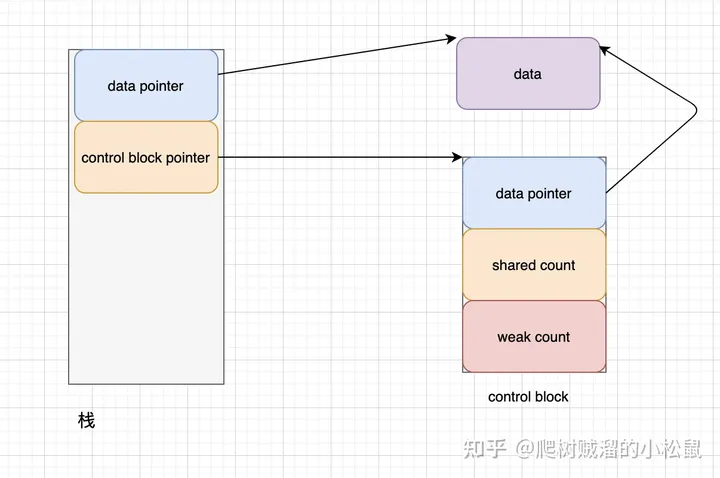
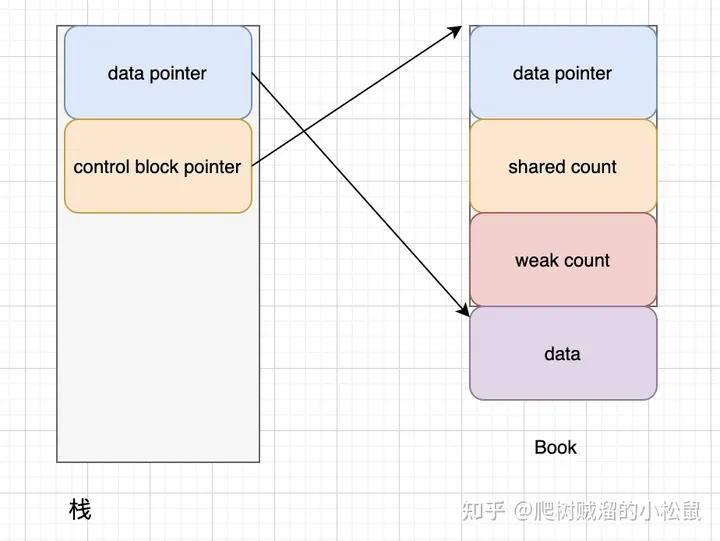
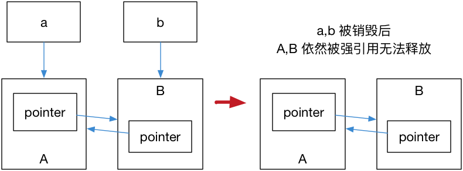
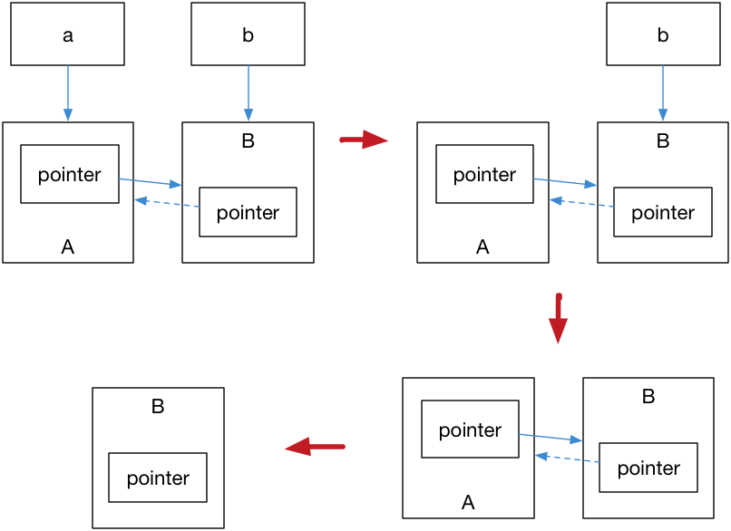

- [智能指针](#智能指针)
  - [unique\_ptr](#unique_ptr)
    - [使用](#使用)
    - [实现](#实现)
  - [shared\_ptr](#shared_ptr)
    - [std::make\_shared](#stdmake_shared)
    - [使用](#使用-1)
    - [实现](#实现-1)
    - [错误示范：](#错误示范)
    - [enable\_shared\_from\_this](#enable_shared_from_this)
      - [enable\_shared\_from\_this 的使用](#enable_shared_from_this-的使用)
      - [enable\_shared\_from\_this 的数据结构](#enable_shared_from_this-的数据结构)
  - [weak\_ptr](#weak_ptr)
    - [使用](#使用-2)
    - [什么是shared\_ptr指针环](#什么是shared_ptr指针环)
    - [如何使用weak\_ptr解决内存泄漏](#如何使用weak_ptr解决内存泄漏)
  - [注意事项 / 实战避坑](#注意事项--实战避坑)
    - [1、尽量避免使用原始指针构建智能指针](#1尽量避免使用原始指针构建智能指针)
    - [2、建议使用 make\_shared/make\_uniqe 构建智能指针](#2建议使用-make_sharedmake_uniqe-构建智能指针)
    - [3、小心使用类的this指针构建shared\_ptr](#3小心使用类的this指针构建shared_ptr)
      - [用 this 构建数据成员 shared\_ptr：](#用-this-构建数据成员-shared_ptr)
      - [函数成员返回shared\_ptr](#函数成员返回shared_ptr)
  - [源码分析](#源码分析)
  - [个人实现](#个人实现)
  - [参考资料](#参考资料)


---
# 智能指针
在 C++ 98/03 里使用 new 和 delete 对资源生命周期进行手动管理（构造+释放）。  
在 C++11 引入了智能指针的概念，使用了引用计数的技术。  
这些智能指针包括 ```std::shared_ptr; std::unique_ptr; std::weak_ptr```，使用它们需要包含头文件 ```<memory>```。

## unique_ptr
std::unique_ptr 是一种独占的智能指针，它禁止其他智能指针与其共享同一个对象。
std::unique_ptr 的本质是禁用拷贝，仅允许使用移动语义。

### 使用
```c++
std::unique_ptr<int> ptr = std::make_unique<int>(42); 
std::unique_ptr<int> ptr2 = ptr; // 非法，使用拷贝
std::unique_ptr<int> ptr2 = std::move(ptr); // 合法，使用移动语义
```

```C++
struct Foo {...};
...
int main(){
     std::unique_ptr<Foo> p1(std::make_unique<Foo>());

    if (p1) p1->foo(); // p1 不空, 输出
    {
        std::unique_ptr<Foo> p2(std::move(p1));
        
        f(*p2); // p2 不空, 输出
        if(p2) p2->foo(); // p2 不空, 输出
        if(p1) p1->foo(); // p1 为空, 无输出
        
        p1 = std::move(p2);
        if(p2) p2->foo();// p2 为空, 无输出
        std::cout << "p2 离开作用域，被销毁" << std::endl;
    }
    if (p1) p1->foo(); // p1 不空, 输出
}
```
### 实现
std::make_unique 从 C++14 引入.
由于C++ 标准委员会在C++11中忘记提供 std::make_unique. 因其逻辑简单，可以在C++11自行实现：
```c++
template<typename T, typename ...Args>
std::unique_ptr<T> make_unique( Args&& ...args ) {
  return std::unique_ptr<T>( new T( std::forward<Args>(args)... ) );
}
```

## shared_ptr
std::shared_ptr 是一种共享对象的智能指针，它使用引用计数记录多少个 shared_ptr 共同指向一个对象，当引用计数变为零的时候就会将对象自动删除。  
多个 shared_ptr 实例通过共享在 “堆上的控制块” 来安全地管理对象的生命周期。  
shared_ptr 主要有两个成员变量，一个是原生指针，一个是控制块的指针，用来存储这个原生指针的shared_ptr和weak_ptr的数量（引用计数）。
### std::make_shared
std::make_shared 会分配创建传入参数中的对象， 并返回这个对象类型的std::shared_ptr指针。

使用 std::make_shared 语法糖，消除显式的使用 new。
使用 0 == shared_ptr<>::use_count（引用计数为零）， 消除显式的调用 delete。
```C++
auto pointer = std::make_shared<int>(42);
```
### 使用
> std::shared_ptr :  
> * 可以通过 get() 方法来获取原始指针。
> * 通过 reset() 来减少一个引用计数。
> * 通过 use_count() 来查看一个对象的引用计数。

```C++
auto pointer = std::make_shared<int>(42);
auto pointer2 = pointer; // 引用计数+1
auto pointer3 = pointer; // 引用计数+1
int *p = pointer.get();  // 这样不会增加引用计数
std::cout << "pointer.use_count() = " << pointer.use_count() << std::endl;   // 3
pointer2.reset();
std::cout << "pointer.use_count() = " << pointer.use_count() << std::endl;   // 2
```

### 实现  

C++标准库有gcc的版本libstdc++和llvm的版本libc++。
> libstdc++的源码地址: https://github.com/gcc-mirror/gcc/blob/devel/omp/gcc-11/libstdc%2B%2B-v3/include/bits/shared_ptr.h

> libc++的源码地址: https://github.com/llvm/llvm-project/blob/release/13.x/libcxx/include/memory



可以看到shared_ptr 有两个指针，一个指向数据，一个指向控制块(control block)。  
控制块用来记录shared_ptr的个数，以及弱引用的个数。  
1、 当shared_ptr的个数为零的时候，数据就会被删除。  
2、 当弱引用的个数为零的时候，控制块就会被删除。  

### 错误示范：  

```c++
class Book {
  public:
    std::shared_ptr<Book> getptr() {
       return std::shared_ptr<Book>(this);
    }
};
Book *data = new Book(3);
std::shared_ptr<Book> p1 = data->getptr();
std::shared_ptr<Book> p2 = data->getptr();
```
我们使用了两个共享智能指针的控制块管理一个数据。那么这两个控制块的计数都有为零的时候，就会导致同样的数据被释放了两次，也就是double free。  

### enable_shared_from_this  
  
#### enable_shared_from_this 的使用

```C++
struct Book: std::enable_shared_from_this<Book> // note: public inheritance 注意：必须公开继承
{
    std::shared_ptr<Book> getptr() {
        return shared_from_this();
    }
};
auto data = std::make_shared<Book>();
auto p = data->get();  //这时候我们只有一个Book*了，也就是this
std::shared_ptr<Book> p1 = p->getptr();
std::shared_ptr<Book> p2 = p->getptr();
```

#### enable_shared_from_this 的数据结构



enable_shared_from_this 必须被继承才能使用，实现了控制块的唯一性，尽管每次创建新的share ptr 都会从shared_from_this() 获取 share ptr。

但是由于只有一个控制块，无论怎么增加和减少引用计数，都只有一份计数，所以计数是准确的，不会double free。

## weak_ptr
如果 shared_ptr 的指针指向形成环，std::shared_ptr 存在资源无法释放的问题。（引用计数永不为零，导致资源无法执行析构，内存泄漏）。  
解决这个问题的办法就是使用弱引用指针 std::weak_ptr，（相比较而言 std::shared_ptr 就是一种强引用）弱引用不会引起引用计数增加。  
<b>将weak_ptr引入并替换shared_ptr进行弱引用指向对象资源，破坏shared_ptr指针环的形成条件。</b>
### 使用
>* expired() 方法能在资源未被释放时，会返回 false，否则返回 true。  
>* lock() 方法在原始对象未被释放时，返回一个指向原始对象的 std::shared_ptr 指针。  
>* use_count() 返回管理该对象的 shared_ptr 对象数量。
>* reset() 释放被管理对象的所有权。
>* swap() 交换被管理对象。

具体详见：[cppreference::weak_ptr](https://zh.cppreference.com/w/cpp/memory/weak_ptr)
### 什么是shared_ptr指针环
```C++
struct A;
struct B;

struct A {
    std::shared_ptr<B> pointer;
    ...
};
struct B {
    std::shared_ptr<A> pointer;
    ...
};
int main() {
    auto a = std::make_shared<A>();
    auto b = std::make_shared<B>();
    a->pointer = b;
    b->pointer = a;
}
```
运行结果是 A, B 都不会被销毁，这是因为内部的 shared_ptr 互相指向，形成环。

### 如何使用weak_ptr解决内存泄漏
将weak_ptr引入并替换shared_ptr进行弱引用指向对象资源，破坏shared_ptr指针环的形成条件。
```C++
struct A;
struct B;

struct A {
    std::shared_ptr<B> pointer;
    ~A() {
        std::cout << "A 被销毁" << std::endl;
    }
};
struct B {
    std::weak_ptr<A> pointer; // 只修改了这一行，即破环shared_ptr的互相引用。
    ~B() {
        std::cout << "B 被销毁" << std::endl;
    }
};
int main() {
    auto a = std::make_shared<A>();
    auto b = std::make_shared<B>();
    a->pointer = b;
    b->pointer = a;
}
·····················
program returned: 0
Program stdout
A 被销毁
B 被销毁
```
对象 B 的 weak_ptr 只是虚指向 A，没有对 A 对象进行引用计数，破坏了 shared_ptr指针环的形成。如图：


## 注意事项 / 实战避坑
### 1、尽量避免使用原始指针构建智能指针
> 1. 不要用原始地址初始化智能指针  

请看这段简单的错误代码，其资源生存在栈上，不管是离开作用域自动析构还是调用reset()手动析构，shared指针(this)未经过new/malloc创建,delete/free失败。
```cpp
void bad_run_1(){ //code_block1
    int mm;
    std::shared_ptr<int> pm = std::shared_ptr<int>(&mm);
    //pm.reset();
}
...
Program stderr: //报错如下
free(): invalid pointer
Program terminated with signal: SIGSEGV
```
> 2. 不要用原始指针初始化多个共享智能指针

当使用原始指针构造或初始化 shared_ptr 时，会创建一个新的控制块。为了确保对象仅由一个共享控制块管理，对对象的任何额外的 shared_ptr 实例必须通过复制已经存在的指向该对象的 shared_ptr 来产生。
<b>使用原始指针初始化已经由 shared_ptr 管理的对象会创建另一个控制块来管理该对象，这将导致未定义的行为。</b>
```c
void bad_run_2() {
 auto p{new int(12)};   
 std::shared_ptr<int> sp1{p};
 std::shared_ptr<int> sp2{p}; //! 未定义行为
}
```

### 2、建议使用 make_shared/make_uniqe 构建智能指针
使用 `new` 的方式创建 shared_ptr 会导致出现两次内存申请，是因为shared_ptr对象在内部指向两个内存位置：
* 一个是指向对象的指针.  
* 一个是指向控制块的指针，用于引用计数数据。
  
当使用new操作符创建shared_ptr时，需要为对象和引用计数控制块分别分配内存，这就导致了两次内存申请。

相比之下，使用make_shared的方式创建shared_ptr只需要一次内存申请，因为它同时分配了引用计数和对象的存储空间。 
这样可以提高内存分配的效率，减少内存碎片，还可以避免一些潜在的内存泄漏或重复析构的问题。

因此，建议在创建shared_ptr时，尽量使用make_shared而不是new，除非有特殊的需求。

### 3、小心使用类的this指针构建shared_ptr
#### 用 this 构建数据成员 shared_ptr：

```c++
#include <iostream>
#include <memory>
using namespace std;

struct Bad1  // 1
{
    ~Bad1() { std::cout << "调用 Bad1::~Bad1()\n"; };
    std::shared_ptr<Bad1> i = std::shared_ptr<Bad1>(this);
    std::shared_ptr<Bad1> other;
};

void testBad1() {
    Bad1 *mybad = new Bad1();
    mybad->i.reset();// 引用计数为零，调用析构
}
void testBad2(){
    Bad1 myBad ;
}
void testBad3() {
    std::shared_ptr<Bad1> mybad = std::make_shared<Bad1>();
    mybad->i.reset(mybad.get()); //i
    //等价于
    //Bad1 *mybad = new Bad1();
    //mybad->i.reset(mybad);
}
void testBad4(){
    std::shared_ptr<Bad1> mybad = std::make_shared<Bad1>();
    mybad->other.reset(mybad.get());  //other
}
int main() {
    testBad1(); //正常执行
    testBad2(); //错误。报munmap_chunk(): invalid pointer
    testBad3(); //错误。报free(): double free
    testBad4(); //正常执行,循环引用内存泄漏
}
```
测试用例1，正常执行
测试用例2，原因与前面的简单代码(//code_block1)逻辑相同，指针未经过new/malloc创建，导致delete/free失败。
测试用例3，提示重复调用free()析构.原因是指向this的share_ptr引用计数减一归零，会调用this的析构函数析构其数据成员，该数据成员share_ptr的引用计数减一归零然后调用其析构函数, 由于前后两个shared_ptr都指向相同地址,都认为它是对象的唯一所有者，导致对同一地址重复调用free()析构。
测试用例4，正常执行,尽管没有用this构建，但循环引用内存泄漏，

#### 函数成员返回shared_ptr
```c++
#include <iostream>
#include <memory>
using namespace std;

struct Bad  // 2
{
    std::shared_ptr<Bad> getptr() { return std::shared_ptr<Bad>(this); }
    ~Bad() { std::cout << "调用 Bad::~Bad()\n"; }
};

void testBad() {
    // 不好，每个 shared_ptr 都认为它是对象的唯一所有者
    std::shared_ptr<Bad> bad0 = std::make_shared<Bad>();
    std::shared_ptr<Bad> bad1 = bad0->getptr();
    std::cout << "bad1.use_count() = " << bad1.use_count() << '\n'; //out: bad1.use_count() = 1
}  // UB： Bad 的二次删除

int main() {
    testBad();
}
```
每次使用 std::shared_ptr<>(this);，都会构建一个新的对象的唯一所有者（智能指针），这是问题根源。  
应该使用 std::enable_shared_from_this 共享该对象的所有权。

## 源码分析  
-规划事项，待完成。
## 个人实现  
 -规划事项，待完成。
## 参考资料    

* lucasfan：C++ 智能指针最佳实践&源码分析  
https://mp.weixin.qq.com/s/b_xlJF1-Cplgs-uawWuUow

* 光城：灵魂拷问std::enable_shared_from_this，揭秘实现原理
https://mp.weixin.qq.com/s/gRx4QKBPTVdlQxwmPVXsqg

* CrackingOysters：智能指针与enable_shared_from_this
https://zhuanlan.zhihu.com/p/415884199