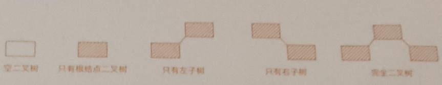
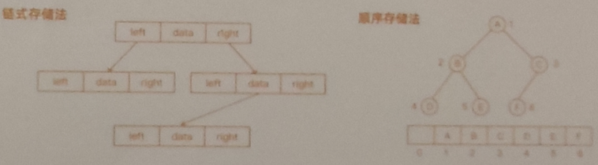

# 树  
### 概念  
树是一种非线性结构，就像真实的树倒挂，具体定义：树是包含n(n >= 0 )个结点的有穷集，其中：  
1. 每个元素称为结点  
2. 有一个特定的结点被称为根结点或树根  
3. 除根结点之外的其余数据元素被分为 m （m >= 0）个互不相交的集合T1，T2，T3，...，T（m-1），其中每一个集合Ti（1 <= i <= m）本身也是一棵树，被称作原树的子树；
### 相关概念  
1. 树的高度 
2. 深度  
3. 层  
4. 树的定义是递归定义的  
5. 根据树中结点最多的子结点引申出二叉树、三叉树、多叉树  
### 二叉树  
#### 概念  
二叉树是每个结点最多有两个子树的的树结构，即左子树和右子树
#### 基本实现和特性  
  
### 基本实现和特性  
#### 满二叉树  
符合叶子结点全部在最底层，除叶子结点外，每个结点都有左右两个子结点的条件就是满二叉树  
#### 完全二叉树  
若设二叉树的深度为 h，除第 h 层外，其他各层( 1 - h - 1)的结点数都达到最大个数，第h层所有的结点都连续集中在最左边，这就是完全二叉树  
#### 二叉搜索树  
##### 定义 : 在树中的任意一个结点，其左子树的值都小于这个结点的值，而右子树结点的值都大于这个结点的值  
- 特性 ：二叉搜索树为了实现快速查找而设计，不仅仅可以快速查找一个数据，还可以快速插入删除   
- 查找操作：先取根结点，如果它等于我们要查找的数就返回；如果查找的教据比根结点的值小，那就在左子树中递归查找；如果要查找的数据比根结点的值大，那就在右子树中递归查找；
- 插入操作：如果要插入的数据比结点的数据大，井且结点的右子树为空，就将新数据直接插到右子结点的位置；如果不为空，就再递归遍历右子树，查找插入位置。同理，如果要插入的数据比结点数值小，并且结点的左子树为空，就将新数据插入到左子结点的位置；如果不为空， 就再递归遍历左子树，查找播入位置；
- 删除操作：需要分三种情况处理  
  1. 如果要删除的结点没有子结点，只需要直接将父亲结点中，指向要删除结点的指针设为NULL；  
  2. 如果要删除的结点只有一个子结点(只有左子结点或者右子结点)，我们只需要更新父结点中，指向要删除结点的指针，让它指向要删除结点的子结点；  
  3. 如果要删除的结点有两个子结点，需要找到这个结点的右子树中的最小结点，把它替换到要删除的结点上，然后再删除掉这个最小结点；  
- 上述的查找、插入和删除的时间复杂度都是O (树的高度)  

#### 平衡二插搜索树（AVL）  
考虑二复树的高度可能退化成单链表的情况，造成插入、删除的效率变成0(n).因此设计出了平衡二双搜索树，高度接近logn,也因此插入删除和查找的时间复杂度接近为Ollogn)
定义:二又树中任意一个结点的左右子树的高度差不能大于1  
#### 红黑树  
定义:红黑树中的结点，一类被标记为黑色，一类被标记为红色
1. 根结点是黑色的  
2. 每个叶子结点都是黑色的空结点，叶子结点不存储数据  
3. 任何相邻的结点都不能同时为红色， 红色节点被黑色结点隔开  
4. 每个结点， 从该结点到达其可达叶子结点的左右路径，都包含相同数目的黑色系结点  
红黑树是一种平衡二叉搜索树，为了解决普通二叉搜索树在数据更新的过程中，复杂退化问题而产生的红黑树的高度近似为 logn，插入删除查找的时间复杂度都是 O(logn)  
#### 二叉树的存储  
1. 基于指针或者引用的二叉链表存储法  
2. 基于数组的顺序存储法，其中完全二叉树使用数组存储是最节省内存的一种方式  
      
#### 遍历方式  
本质上上述遍历是一个递归的过程，且时间复杂度为 O(n)

##### 广度优先搜索  
 - 也称为层次遍历  
##### 深度优先搜索  
- 前序遍历  
- 中序遍历  
- 后序遍历  
#### 常考面试题  
1. 判断一棵树是否平衡  
2. 求二叉树的深度  
3. 二叉树的递归遍历、非递归遍历  
4. 二叉树的最大路径和  
5. 所有路径的给定和   
6. 二叉树的最低公共父结点  
7. 求二叉树第 K 层的结点个数  
8. 树的层序遍历  
