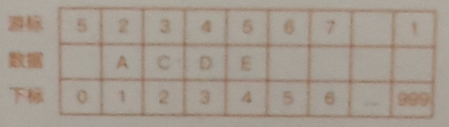

## 链表
#### 基本概念  
链表是一种物理存储单元上非连续、非顺序的存储结构，数据元素的逻辑顺序是通过链表中的指针链接次序实现的，链表存在多种形式；  

#### 内存分布(区分数组)  

#### 单链表
- 基本实现和特性：每个结点包括两个部分：一个是存储数据元素的数据域，另一个是存储下一个结点地址的指针域，只有一个后继结点；
- 示例图：
  - 
- 重点概念：头结点、尾节点

  - 建立链表：本质上就是不断的插入结点；
  - 插入结点：就是申请空间、得到数据、建立链接的循环处理过程
    - 1.重点考虑相邻结点的指针改变，推荐画图法
    - 2.在指定指针的情况下插入结点，时间复杂度0(1),分为头插法和尾插两种
    - 3.如果没有指定指针的时候，则需要遍历先确定插入位置，再执行2,时间复杂度O(n)
    - 4.注意头结点的插入
    - 
    - 
  - 删除结点：
    - 1.删除结点中“值为给定某个值”的结点，时间复杂度0(1)
    - 2.删除给定指针的结点，需要遍历前驱结点，时间复杂度0(n)
    - 3.注意删除头结点、尾结点，推荐画图法
    - 
  - 遍历链表：O(n)  
  - 和数组性能比较
    - 
  - 查找结点：
    - 1.根据指针依次查找，直到找到相应的结点(考虑多个的情况)
    - 2.时间复杂度0(n)

#### 循环链表  
- 基本实现和特性  
	- 1.尾结点指针指向头结点的链表
	- 2.可以是单链表，也可以是双链表
	- 
	- 
	- 操作
		- 1.优点是从链尾到链头十分方便
		- 2.经典问题:约瑟夫问题

#### 双向链表  
- 基本概念和特性  
  - 不同于单向链表只有一个方向，结点只有一一个后继指针next指向后面的结点；
  - 双向链表，支持两个方向，每个结点不止有一一个后继指针next指向后面的结点，还有一个前驱指针 prev 指向前面的结点；
  - 占用更多空间的同时插入和删除效率更高；
- 示例图
  - 
- 快速插入删除
  - 1.删除给定指针指向的结点，直接获取前驱结点，不需要遍历，时间复杂度为0(1)，插入的情况类似删除；
  - 2.实际使用例子: Java 的LinkedHashMap；
  - 3.空间换时间的思想；

#### 静态链表  
- 基本概念和特性  
	- 用数组描述的链表，即称为静态链表；
	- 首先让数组的元素都是由两个数据域构成，data和cur, 也就是说每一个数组的下标都要对应一个data和一个cur；
	- 数据城data用来存放数据元素，也就是通常我们要处理的数据，而cur相当于单链表中的next指针，存放该元素的后继在数组中的下标，我们把cur叫做游标；
- 示例图  
	- 

#### 常考面试题  
 1. 从尾到头打印单链表;  
 2. 单链表实现约是夫环( Joseph Circle )
 3. 逆置/反转单链表  
 4. K 个节点为一组进行翻转  
 5. 返回链表中间 (1/2) 节点 (扩展返回链表 1/K 节点)  
 6. 单链表排序 (冒泡排序 & 快速排序)  
 7. 查找单链表的中间节点，要求只能遍历一次链表  
 8. 查找单链表的倒数第K个节点，要求只能遍历一-次链表  
 9. 删除链表的倒数第K个结点  
 10. 判断单链表是否带环? 若带环，求环的长度? 求环的入口点? 并计算每个算法的时间复杂度 & 空间复杂度  
 11. 判断两个链表是否相交，若相交，求交点(假设链表不带环)  
 12. 判断两个链表是否相交，若相交，求交点(假设链表可能带环)  
 13. 求两个已排序单链表中相同的数据  
 14. 合并两个有序链表，合并后依然有序  